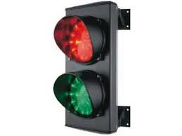

# Type classes usage patterns

Toni Cebrián

----

## Excursion

- The meaning of functional in FP <!-- .element: class="fragment" data-fragment-index="1" -->
- Programming with effects        <!-- .element: class="fragment" data-fragment-index="2" -->
- Type classes                    <!-- .element: class="fragment" data-fragment-index="3" -->
- Typeclassopedia                 <!-- .element: class="fragment" data-fragment-index="4" -->


---

# The meaning of functional in Functional Programming

----

$\Huge{f}$

----

$\Huge{f(x)}$

----

$\Huge{=}$

----

$\Huge{f(x)=g(x)}$ 

$\Huge{g(x)=f(x)}$ <!-- .element: class="fragment" data-fragment-index="1" -->

Note: this allows us to do equational reasoning

----

$\Huge{f(x) = 5}$

----

$\Huge{f(x) = \pi}$

----

$\Huge{f(x) = sin(x)}$

----

$\Huge{f(x) = \sqrt{x}}$

---

# Programming with effects

----

$$
\Large{\frac{1}{0}}
$$

$$\Large{\sqrt{-1}}$$ <!-- .element: class="fragment" data-fragment-index="1" -->

----

$$
{inv: \mathbb{Z} \rightarrow \mathbb{R}}, \quad inv(x) = ???
$$

----

$$
{inv: \mathbb{Z} \rightarrow \mathbb{R}}, \quad inv(x) = 
 \begin{cases}
  \frac{1}{x} & x \neq 0  \\\\
   ??? & x = 0
  \end{cases}
$$

----

$$
{inv: \mathbb{Z} \rightarrow \mathbb{R}}, \quad inv(x) = 
 \begin{cases}
  \frac{1}{x} & x \neq 0  \\\\
   \varnothing & x = 0
  \end{cases}
$$

How does it look in functional style?
<!-- .element: class="fragment" data-fragment-index="0" -->

```scala
def inv(x:Integer):Option[Double] = if (x!=0) 
                                       Some(1/x)
                                    else 
                                       None 
```
<!-- .element: class="fragment" data-fragment-index="1" -->

----

${sqrt:\mathbb{R} \rightarrow \mathbb{R}}, \quad sqrt(x) = ???$ 

----

$$
{sqrt:\mathbb{R} \rightarrow \mathbb{R}}, \quad sqrt(x) = 
 \begin{cases}
  \sqrt{x} & x \geq 0  \\\\
   ??? & x < 0
  \end{cases}
$$ 

----

$$
{sqrt:\mathbb{R} \rightarrow \mathbb{C}}, \quad sqrt(x) = 
 \begin{cases}
  \sqrt{x} & x \geq 0  \\\\
   \sqrt{-x}j & x < 0
  \end{cases}
$$ 

How does it look in functional style?
<!-- .element: class="fragment" data-fragment-index="0" -->

```scala
sealed abstract class RootResult
case class Real(val v:Double) extends RootResult
case class Img(val v:Double) extends RootResult

def sqrt(x:Double):RootResult = if (x>=0) 
                                   Real(math.sqrt(x))
                                else 
                                   Img(math.sqrt(-x))
```
<!-- .element: class="fragment" data-fragment-index="1" -->

----

## Take aways

There are lots of interesting effects:

- IO
- Futures
- Exceptions
- ...

> In a functional language effects are modelled by mapping those effects to
> algebraic data types so we are still working with pure functions
<!-- .element: class="fragment" data-fragment-index="1" -->

---

# The need for Type classes 

----

## The expression problem (1)

- How to add new cases and functions to a datatype
- How to do so without recompiling and without casting
- Data & operations should be *extensible*

Note: https://en.wikipedia.org/wiki/Expression_problem

----

## The expression problem (2)

- In FP, adding new functions is cheap, modifying data is hard
- In OO, adding new functions is hard, modifying data is cheap

Note:
http://userpages.uni-koblenz.de/~laemmel/paradigms1011/resources/pdf/xproblem.pdf

----

## Example



- Lights are modelled as separate entities
- Light entities can be queried for allowing pass in a street

----

- **QUESTION:** How would you add the `equals` functionality in OO?
- **QUESTION:** How would you rework all your existing logic in FP?

----

----

## Type classes an unfortunate name

Type classes are a type construct that enforces that a given type belongs to a
set of "like minded" types 

So maybe `Type Sets`??

----

## Let's define the contract

```scala
trait CanCrossy[A] { self =>
  def crossys(a: A): Boolean
}
```

```scala
object CanCrossy {
  def apply[A](implicit ev: CanCrossy[A]): CanCrossy[A] = ev
  def crossys[A](f: A => Boolean): CanCrossy[A] = new CanCrossy[A] {
    def crossys(a: A): Boolean = f(a)
  }
}
```

----

```scala
trait CanCrossyOps[A] {
  def self: A
  implicit def F: CanCrossy[A]
  final def crossy: Boolean = F.truthys(self)
}
```

```scala
object ToCanIsCrossyOps {
  implicit def toCanIsCrossyOps[A](v: A)(implicit ev: CanCrossy[A]) =
    new CanCrossyOps[A] {
      def self = v
      implicit def F: CanCrossy[A] = ev
    }
}
```

----

```scala
import ToCanIsCrossyOps._
```

----

```scala
scala> implicit val trafficLightCanCrossy: CanCrossy[TrafficLight] = CanCrossy.crossys({
         case Red    => false
         case Yellow => false
         case _      => true
       })

scala> Yellow.crossys
res6: Boolean = false
```

----

## Kinds

Same as we have functions mapping values from one value in a type to another
value in another type

```scala
f: A => B
```


A kind is the type of a type constructor  <!-- .element: class="fragment" data-fragment-index="0" -->

```scala  
Option : * -> *
```
<!-- .element: class="fragment" data-fragment-index="0" -->

----

# Typeclassopedia

----

## Functor

```scala
trait Functor[F[_]]  { self =>
  /** Lift `f` into `F` and apply to `F[A]`. */
  def map[A, B](fa: F[A])(f: A => B): F[B]

  ...
}
```

----

## Applicative

What happens when our function to map has more input parameters than $f:A \rightarrow B$?

```scala
trait Functor[F[_]]  { self =>
  /** Lift `f` into `F` and apply to `F[A]`. */
  def map[A, B](fa: F[A])(f: A => B): F[B]

  ...
}
```

----

## Monoid

```scala
trait Semigroup[A]  { self =>
  def append(a1: A, a2: => A): A
  ...
}
```

```scala
trait Monoid[A] extends Semigroup[A] { self =>
  ////
  /** The identity element for `append`. */
  def zero: A

  ...
}
```

----

## Monad


```scala
trait Monad[F[_]]  { self =>

  def point[A](a:A):F[A]

  def bind[A,B](fa: F[A])(f: A => B)
}
```

---

## References

- [Learning Scalaz](http://eed3si9n.com/learning-scalaz/)
- [Category Theory for
  Programmers](http://bartoszmilewski.com/2014/10/28/category-theory-for-programmers-the-preface/)
